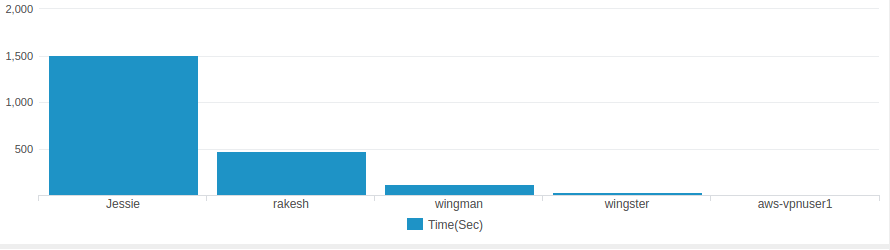
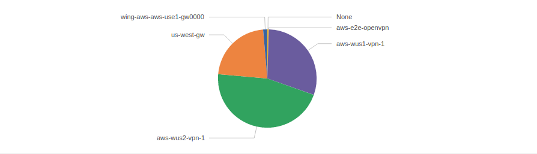
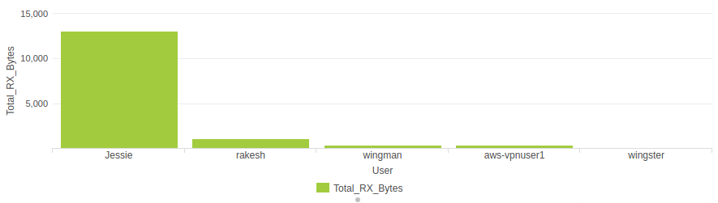
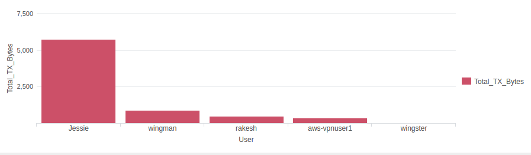
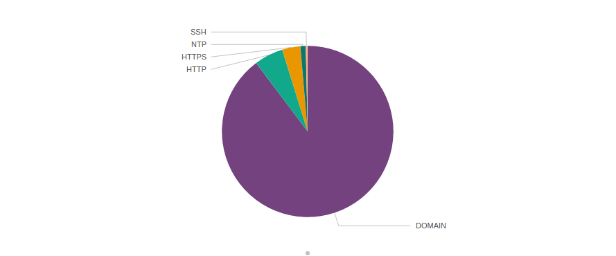
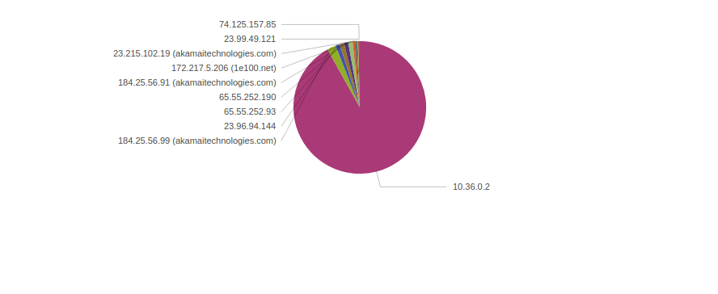
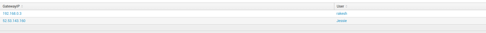
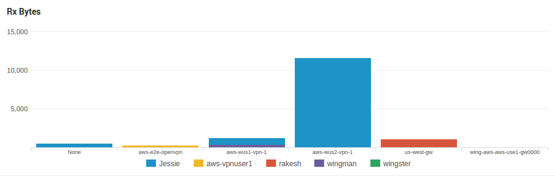

# Aviatrix App for Splunk
Copyright &copy; 2014-2015 Aviatrix Systems,Inc. All rights reserved.

* **App Homepage:** To be published
* **Authors:** Rakesh Ranjan
* **App Version:** 1.0

### Description ###
Aviatrix App for Splunk is an advanced reporting and analysis tool for Aviatrix Cloud controller. This app leverages Aviatrix controller logs and Splunk's search and visualization capabilities to provide monitoring and troubleshooting capabilities along with rapid insight and operational visibility for hybrid cloud.

## Getting Started

### Step1: Install App

This App is available on [Github](https://github.com/AviatrixCommunity/SplunkforAviatrix)
You can clone the github repository to install the App.
From ``$SPLUNK_HOME/etc/apps/`` directory, type the following command::
  
    git clone https://github.com/AviatrixCommunity/SplunkforAviatrix.git SplunkforPaloAltoNetworks

Alternatively you can download zipped app from this github repository by clicking `Clone or download > Download ZIP`, and then install it directly via Splunk Enterprise UI.

### Step 2: Initial Setup
Make sure the latest version of Aviatrix software is installed before you start to configure the controller. You
should see the alert for software upgrade on the menu bar of the controller if a newer version is available.
Click Upgrade and wait for the upgrade to complete.

Follow the steps below to enable the logging for Splunk and Sumo Logic.

1. Launch the web browser and input the URL of your controller.
2. Once logged in, navigate to Settings > Loggings.
3. On the right hand side, enable the logging for Splunk by clicking the status button area. A new panel will appear for you to input Splunk IP Address and Splunk Server Listening Port. Enter Splunk enterprise IP address and port number(Splunk listens on port 9997 by default for forwarders). Click Enable when you are done.
4. To enable AviatrixRule logging, select packet logging when configuring gateway security policies. This is done by clicking the gateway of interests at Gateway panel.
5. To verify if the logs are delivered to the specified Splunk and Sumo Logic servers, make a user VPN connection through any gateway managed by the controller. At the prompt on Search bar of Splunk, type Aviatrix* and you shall see the Aviatrix logs.

# Features
This app comes with few prebuilt dashboards.

### Overview

This dashboard shows an overview of all the traffic logs collected by Splunk from Aviatrix controller.

##### 1. VPN Gateway locations by number of connections

##### 2. Top 10 VPN connection duration by users

##### 3. Total User connection time by gateway

##### 4. Total Rx Bytes by VPN User connection

##### 5. Total Tx Bytes by VPN User connection

##### 6. Destination services by number of connections

##### 7. Destination IP

##### 8. Active VPN Sessions

### VPN Session

This dashboard analyses data specific to VPN sessions. By default, it shows charts for all VPN sessions, but it can be filtered to show data corresponding to a VPN user in a particular gateway.
##### 1. Rx Bytes

##### 2. Tx Bytes

# Support
Found a bug or need a feature?
  [Open an issue on github](https://github.com/AviatrixSystems/SplunkforAviatrix/issues)

